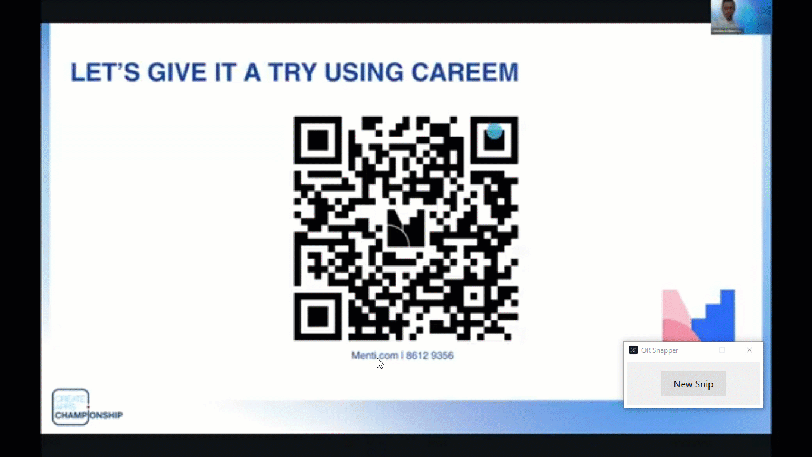

# QR-Snapper

A simple Windows utility to snip and decode QR codes directly from your screen. Built with C# and WPF on .NET 8.

---

## The Problem

Ever been in a Zoom meeting or watching a presentation where a link is shared via a QR code? 

To avoid distractions, I keep my phone away during work. I looked for a simple desktop tool to read a QR code directly from my screen, but every app I found wanted to use my laptop's camera, which wasn't a solution.

## The Solution: QR-Snapper

Since I couldn't find the tool I needed, I built it. **QR-Snapper** is a lightweight utility that acts like the Windows Snipping Tool, but specifically for QR codes.

### Features
*   **Instant Snip-to-Decode:** Launch the tool, select an area on your screen, and get the result instantly.
*   **Automatic Clipboard Copy:** The decoded text (like a URL) is automatically copied to your clipboard.
*   **Clickable Link:** The result is shown in a clean dialog with a clickable hyperlink to open in your browser.
*   **Simple & Lightweight:** A small, standalone executable with a minimal and intuitive interface.

## How to Use

1.  **[Releases page](https://github.com/SaleemAlsalehUAE/QR-Snapper/releases/latest)**.
2.  Download the latest `QRCodeSnapper.exe` file.
3.  Run the executable. A small control window will appear.
4.  Click "New Snip" (or press `Alt+N`) to activate the overlay.
5.  Click and drag a rectangle around any QR code on your screen.
6.  That's it! The result will be displayed and copied to your clipboard.

## Tech Stack
*   C# & .NET 8
*   Windows Presentation Foundation (WPF) for the UI
*   [ZXing.Net](https://github.com/micjahn/ZXing.Net) library for QR code decoding

## Contributing
Feel free to open an issue for any bugs or feature requests. Pull requests are also welcome!
